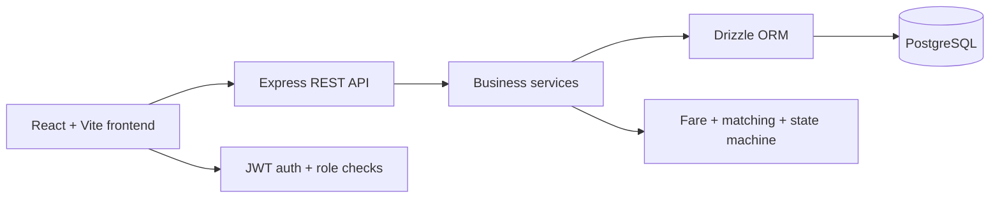

# Architecture

## High-level flow

## Why this architecture

- React + Vite keeps the UX simple and fast for a focused MVP.
- Express provides a quick, predictable API for the required REST endpoints.
- PostgreSQL matches the relational data model: users, vehicles, rides, pools, members, and history.
- Drizzle supports typed SQL and keeps schema changes explicit via migrations.
- JWT and Zod enforce basic security and input validation without overcomplicating the system.

## Data flow

1. A passenger creates a ride request through the passenger flow.
2. The API validates the payload and calculates an estimate using the fare service.
3. The driver dashboard lists compatible requests and accepts them into a pool.
4. The service layer checks vehicle capacity and applies a row lock in PostgreSQL for concurrency safety.
5. Status transitions are recorded in ride_status_history for auditability.
6. Completed rides keep the final fare and historical state for later review.

## Design assumptions

This project intentionally uses simplified geography and deterministic route matching rather than map APIs. That keeps setup local, free, and easy to explain in interviews.
