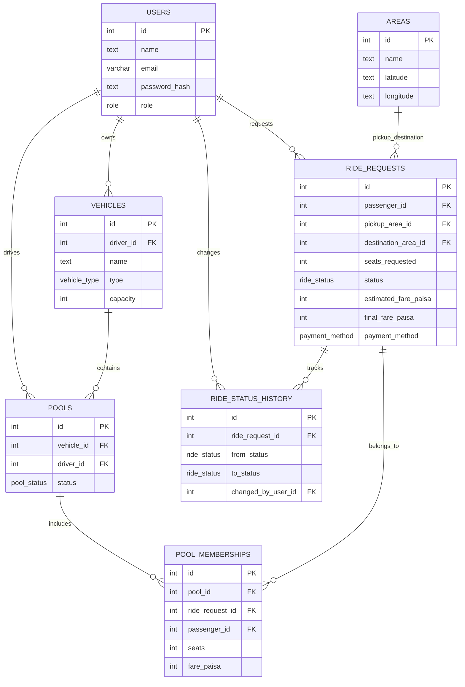

# ERD

```mermaid
erDiagram
  USERS ||--o{ VEHICLES : owns
  USERS ||--o{ RIDE_REQUESTS : requests
  USERS ||--o{ POOLS : drives
  USERS ||--o{ RIDE_STATUS_HISTORY : changes
  AREAS ||--o{ RIDE_REQUESTS : pickup_destination
  VEHICLES ||--o{ POOLS : contains
  POOLS ||--o{ POOL_MEMBERSHIPS : includes
  RIDE_REQUESTS ||--o{ POOL_MEMBERSHIPS : belongs_to
  RIDE_REQUESTS ||--o{ RIDE_STATUS_HISTORY : tracks

  USERS {
    int id PK
    text name
    varchar email
    text password_hash
    role role
  }
  VEHICLES {
    int id PK
    int driver_id FK
    text name
    vehicle_type type
    int capacity
  }
  AREAS {
    int id PK
    text name
    text latitude
    text longitude
  }
  RIDE_REQUESTS {
    int id PK
    int passenger_id FK
    int pickup_area_id FK
    int destination_area_id FK
    int seats_requested
    ride_status status
    int estimated_fare_paisa
    int final_fare_paisa
    payment_method payment_method
  }
  POOLS {
    int id PK
    int vehicle_id FK
    int driver_id FK
    pool_status status
  }
  POOL_MEMBERSHIPS {
    int id PK
    int pool_id FK
    int ride_request_id FK
    int passenger_id FK
    int seats
    int fare_paisa
  }
  RIDE_STATUS_HISTORY {
    int id PK
    int ride_request_id FK
    ride_status from_status
    ride_status to_status
    int changed_by_user_id FK
  }
```
