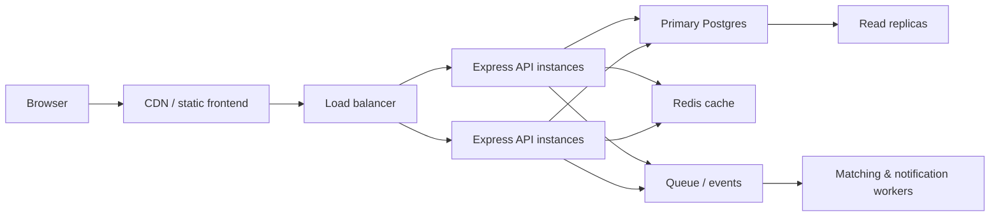

# Scaling discussion

## Future scaling architecture — NOT part of MVP

## Considerations

- Use load balancing and horizontal API scaling once traffic grows beyond a single instance.
- Add indexing and read replicas for heavier reporting and dashboard queries.
- Introduce rate limiting and idempotency keys for trip creation and payment-like actions.
- Cache area metadata and common fare tables.
- Use background workers for expensive matching jobs if the market expands.
- Add real-time notifications later via WebSockets or a queue-based event layer.

## What not to introduce yet

- Kafka or a distributed queue layer is unnecessary for this MVP.
- Redis is not required unless caching or session needs become measurable.
- Complex geospatial search is unnecessary given the small predefined geography dataset.
